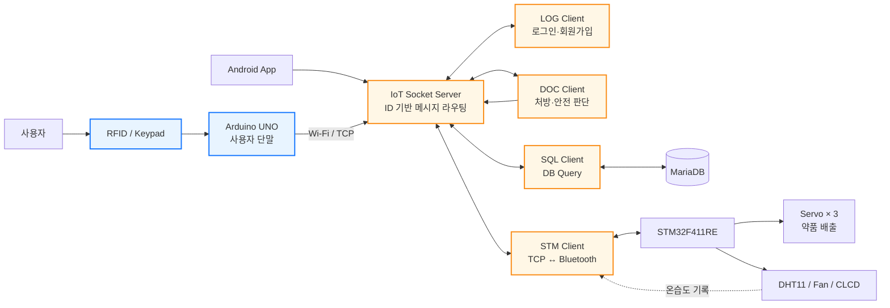
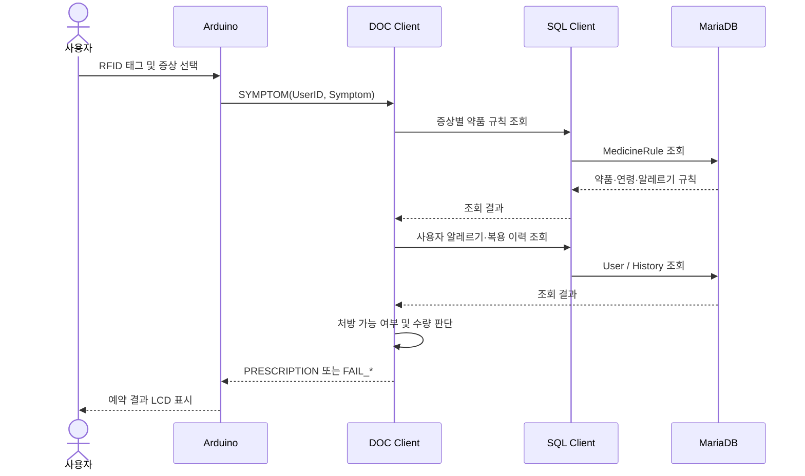
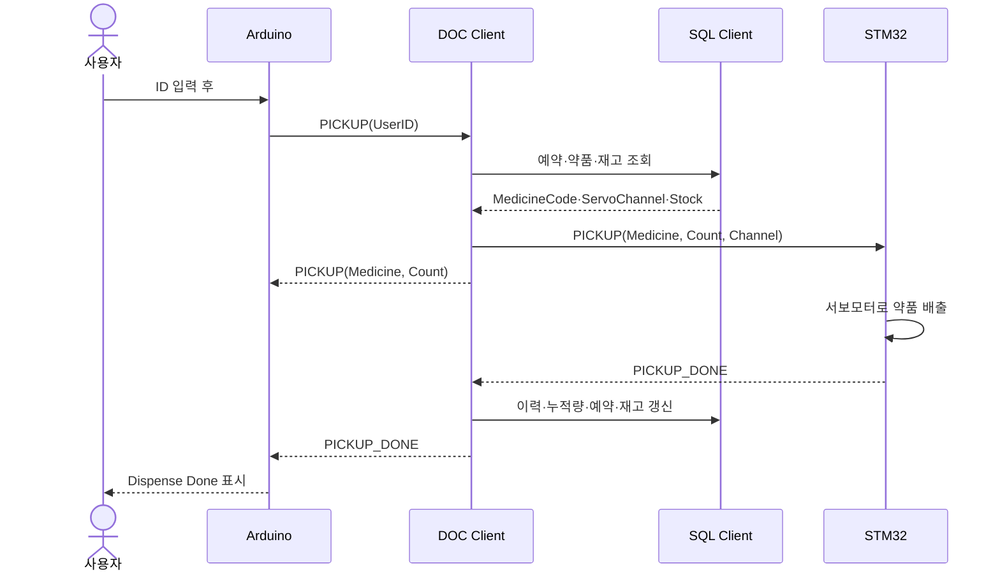

<div align="center">

# 💊 Smart Medicine Dispenser

### RFID·증상 기반 무인 스마트 의약품 처방 및 배출 시스템

사용자를 식별하고 증상·나이·알레르기·복용 이력·재고를 확인한 뒤,<br>
승인된 약만 STM32 기반 디스펜서에서 자동으로 배출합니다.

</div>

---

## 📌 Project Overview

Smart Medicine Dispenser는 사용자가 RFID 카드 또는 키패드로 본인을 인증하고, 증상을 선택하면 복용 조건을 확인하여 적절한 의약품을 예약·배출하는 AIoT 시스템입니다.

Arduino UNO는 사용자와 직접 상호작용하는 입력 단말을 담당합니다. 요청은 Wi-Fi를 통해 TCP 서버로 전달되며, 서버에 연결된 역할별 클라이언트가 처방 판단, DB 조회, 로그인, STM32 중계를 나누어 처리합니다. 최종 배출은 STM32가 서보모터를 제어하여 수행하고, 실제 배출 완료가 확인된 뒤 복용 이력과 재고를 갱신합니다.

| 항목 | 내용 |
| --- | --- |
| 사용자 입력 | RFID 카드, 4×4 키패드 |
| 사용자 출력 | 16×2 I2C LCD, 동작 상태 LED |
| 네트워크 | ESP-01/ESP8266 Wi-Fi, TCP/IP |
| 중앙 처리 | 멀티클라이언트 TCP 서버, 역할별 C 클라이언트 |
| 제어 장치 | Arduino UNO, NUCLEO-F411RE |
| 약품 배출 | 3채널 서보모터 |
| 환경 관리 | DHT11 온습도 측정, 온도 기반 팬 제어 |
| 데이터베이스 | MariaDB |
| 주요 언어 | C, C++, SQL, PHP |

> **입력은 Arduino, 판단과 데이터 처리는 서버 클라이언트, 실제 배출은 STM32가 담당합니다.**

---

## 📂 Contents

- [👨‍💻 My Contribution](#-my-contribution)
- [🧩 System Architecture](#-system-architecture)
- [✨ Key Features](#-key-features)
- [🔄 Service Flow](#-service-flow)
- [🖥️ Arduino User Terminal](#-arduino-user-terminal)
- [🌐 Client System](#-client-system)
- [📡 Communication Protocol](#-communication-protocol)
- [🧪 Troubleshooting & Design Decisions](#-troubleshooting--design-decisions)
- [🛠️ Tech Stack](#-tech-stack)
- [🚀 Build & Run](#-build--run)
- [📁 Repository Guide](#-repository-guide)

---

## 👨‍💻 My Contribution

### 개인 구현

이 프로젝트에서 **Arduino UNO 기반 사용자 입력 단말을 직접 구현**했습니다.

| 담당 | 구현 내용 |
| --- | --- |
| **사용자 인증** | MFRC522 RFID UID 인식 및 사용자 ID 매핑, 키패드 ID 입력 |
| **사용자 인터페이스** | 16×2 I2C LCD 화면 구성, 증상 선택 메뉴, 진행·성공·실패 상태 표시 |
| **상태 관리** | `IDLE → INPUT_ID/SYMPTOM → WAIT → WAIT_DISPENSE → RESULT` 상태 머신 |
| **네트워크 통신** | ESP-01/ESP8266 연결, TCP 서버 로그인, 자동 재연결 |
| **프로토콜 처리** | 개행 단위 수신 버퍼, `PICKUP`·`PRESCRIPTION`·`PICKUP_DONE`·`FAIL_*` 메시지 파싱 |
| **비동기 동작** | `millis()` 기반 화면 전환·응답 타임아웃 처리로 입력과 소켓 수신을 함께 유지 |
| **예외 처리** | 미등록 카드, 서버 응답 지연, 재고 부족, 알레르기·연령·복용량 제한 결과 안내 |

### 팀 공동 구현

`client/` 디렉터리의 네트워크 및 서비스 클라이언트는 **팀원들과 함께 설계하고 구현한 공동 작업 영역**입니다.

| 공동 구현 영역 | 주요 기능 |
| --- | --- |
| **IoT Socket Server** | 클라이언트 인증, 멀티스레드 연결 관리, ID 기반 메시지 라우팅, 접근 권한 제한 |
| **DOC Client** | 증상별 약품 조회, 나이·알레르기·복용 이력 검사, 예약 및 배출 순서 제어 |
| **LOG Client** | 사용자 로그인, 회원가입, 중복 ID 확인 |
| **STM Client** | TCP ↔ Bluetooth 양방향 중계, STM32 환경 센서 데이터 저장 |
| **SQL/MariaDB Client** | 사용자·약품·센서 데이터 조회 및 갱신 |

STM32 펌웨어와 전체 하드웨어 연동은 팀 프로젝트의 통합 영역이며, 이 README는 제가 직접 구현한 **Arduino 단말**과 공동 구현한 **클라이언트 시스템**을 중심으로 설명합니다.

---

## 🧩 System Architecture



- 파란색: 개인 구현 영역
- 주황색: 팀 공동 구현 영역

### 역할 분리

1. **Arduino**는 사용자 입력과 화면 표시만 담당합니다.
2. **Socket Server**는 메시지의 목적지 ID를 확인해 각 클라이언트로 전달합니다.
3. **DOC Client**는 DB 조회 결과를 조합해 처방·예약·배출 가능 여부를 판단합니다.
4. **SQL Client**는 MariaDB 접근을 전담합니다.
5. **STM Client**는 TCP 메시지를 Bluetooth UART로 중계합니다.
6. **STM32**는 승인된 약품의 서보 채널을 구동하고 배출 완료를 회신합니다.

---

## ✨ Key Features

### 1. 두 가지 사용자 흐름

- **RFID 기반 신규 처방**: 카드 인식 → 증상 선택 → 복용 조건 검사 → 약 예약
- **키패드 기반 예약 수령**: 사용자 ID 입력 → `#` 확인 → 예약 조회 → 약 배출

### 2. 사용자별 안전 조건 확인

DOC Client는 DB 조회 결과를 바탕으로 다음 조건을 순차적으로 확인합니다.

- 증상과 일치하는 약품 존재 여부
- 사용자 알레르기와 약품 알레르기 태그 일치 여부
- 최소 복용 연령 및 연령별 지급 수량
- 최근 24시간 복용 횟수
- 누적 복용량과 과다 복용 위험
- 기존 예약 및 현재 재고

조건을 통과하지 못하면 `FAIL_ALLERGY`, `FAIL_AGE_LIMIT`, `FAIL_24H_LIMIT`, `FAIL_STOCK` 등의 결과를 반환하고 Arduino LCD에 원인을 표시합니다.

### 3. 실제 배출 완료 후 DB 반영

약품 배출 명령을 보냈다는 이유만으로 재고를 먼저 차감하지 않습니다. STM32의 `PICKUP_DONE`을 받은 뒤에만 다음 작업을 진행합니다.

```text
배출 완료 확인
  → 복용 이력 기록
  → 누적 복용량 갱신
  → 예약 코드 초기화
  → 약품 재고 차감
  → 사용자 단말에 최종 완료 알림
```

### 4. 환경 모니터링

STM32는 DHT11로 내부 온습도를 측정하고, 설정 온도 이상에서 팬을 동작시킵니다. 환경 데이터는 STM Client가 수신해 MariaDB 센서 테이블에 저장합니다.

### 5. 역할 기반 접근 제어

- Android 클라이언트는 SQL Client에 직접 접근할 수 없습니다.
- Android는 LOG의 로그인·회원가입과 DOC의 증상 요청만 사용할 수 있습니다.
- `MedicineCode`, `CumMedicine`과 같은 핵심 의약 데이터는 DOC Client만 변경할 수 있습니다.

---

## 🔄 Service Flow

### 증상 기반 처방 및 예약



### 예약 약품 수령



---

## 🖥️ Arduino User Terminal

📂 [`Arduino/smart_despenser.cpp`](Arduino/smart_despenser.cpp)

### 하드웨어 구성

| 모듈 | 역할 | 연결 |
| --- | --- | --- |
| Arduino UNO | 사용자 단말 제어 | Main MCU |
| MFRC522 | RFID 카드 UID 인식 | SPI |
| 4×4 Keypad | 사용자 ID 및 증상 입력 | Digital GPIO |
| 16×2 LCD | 상태·결과 표시 | I2C, `0x27` |
| ESP-01/ESP8266 | TCP 서버 연결 | SoftwareSerial |
| Busy LED | 처리 진행 상태 표시 | GPIO |

### 상태 머신

| 상태 | 동작 |
| --- | --- |
| `ST_IDLE` | RFID 또는 키패드 입력 대기 |
| `ST_INPUT_ID` | 사용자 ID 입력 및 픽업 요청 준비 |
| `ST_SYMPTOM` | 6가지 증상 중 하나 선택 |
| `ST_WAIT` | DOC Client의 처방·예약 조회 결과 대기 |
| `ST_WAIT_DISPENSE` | STM32의 실제 배출 완료 대기 |
| `ST_RESULT` | 완료 또는 실패 결과를 일정 시간 표시 |

### 비블로킹 수신 처리

TCP는 한 번의 `read()`가 한 메시지와 일치한다는 보장이 없습니다. 수신 바이트를 버퍼에 누적하고 개행 문자를 만났을 때만 한 줄을 파싱합니다.

```text
TCP byte stream
    → line buffer
    → '\n' 또는 '\r' 확인
    → 명령/인자 분리
    → 상태 전이 및 LCD 갱신
```

화면 전환과 타임아웃은 긴 `delay()` 대신 `millis()`로 관리해, 약품 정보가 표시되는 동안에도 네트워크 수신과 키 입력을 계속 처리합니다.

---

## 🌐 Client System

### IoT Socket Server

📂 [`client/iot_socket/iot_server.c`](client/iot_socket/iot_server.c)

- ID와 비밀번호 기반 클라이언트 인증
- `pthread` 기반 다중 클라이언트 연결 처리
- `[목적지]COMMAND@...` 형식의 메시지 라우팅
- 접속 중복 방지 및 연결 해제 관리
- Android의 SQL 직접 접근 차단
- 의약 핵심 데이터 변경 권한을 DOC Client로 제한

### DOC Client

📂 [`client/doc_client/doc_client.c`](client/doc_client/doc_client.c)

- 증상별 의약품 규칙 조회
- 알레르기, 연령, 24시간 복용 횟수, 누적 복용량 검증
- 예약 코드 생성 및 기존 예약 확인
- 약품 종류·수량·서보 채널·재고 확인
- 배출 완료 이후 이력 및 재고를 순차 갱신하는 상태 머신

### LOG Client

📂 [`client/log_client/log_client.c`](client/log_client/log_client.c)

- Android 사용자의 로그인 요청 처리
- 사용자 ID 중복 확인 및 신규 사용자 등록
- SQL Client 응답을 Android용 결과 메시지로 변환

### STM Client

📂 [`client/stm_client/stm_client.c`](client/stm_client/stm_client.c)

- TCP Server → Bluetooth → STM32 명령 중계
- STM32 → Bluetooth → TCP Server 완료 메시지 중계
- `[ENV@TEMP:...@HUM:...]` 환경 데이터 분리 및 MariaDB 저장

### SQL/MariaDB Client

📂 [`client/mariadb/sql_client/iot_client_sensor_device.c`](client/mariadb/sql_client/iot_client_sensor_device.c)

- MariaDB 연결 관리
- 서버 메시지에 따른 데이터 조회·추가·갱신
- 조회 결과를 요청 클라이언트에 다시 전달

---

## 📡 Communication Protocol

모든 TCP 메시지는 목적지와 명령, 인자를 조합한 텍스트 프로토콜을 사용합니다.

```text
[DESTINATION]COMMAND@ARG1@ARG2@...
```

Socket Server는 목적지 클라이언트에 메시지를 전달할 때 헤더를 발신자 ID로 바꿉니다.

```text
Arduino 송신 : [DOC]PICKUP@11111
DOC 수신     : [ARD]PICKUP@11111
```

| 방향 | 메시지 예시 | 의미 |
| --- | --- | --- |
| ARD → DOC | `[DOC]SYMPTOM@11111@Headache` | 증상 기반 처방 요청 |
| ARD → DOC | `[DOC]PICKUP@11111` | 예약 약품 수령 요청 |
| DOC → ARD | `[ARD]PRESCRIPTION@Tylenol@2` | 처방 및 예약 결과 |
| DOC → ARD | `[ARD]PICKUP@Tylenol@2` | 배출 시작 알림 |
| DOC → STM | `[STM]PICKUP@Tylenol@2@1` | 1번 서보 채널에서 2알 배출 |
| STM → DOC | `[DOC]PICKUP_DONE@11111@Tylenol@2` | 실제 배출 완료 |
| STM → Gateway | `[ENV@TEMP:25.3@HUM:45]` | 환경 센서 데이터 |

### 주요 실패 코드

| 코드 | 의미 |
| --- | --- |
| `FAIL_EMPTY` | 예약된 약품 없음 또는 이미 수령함 |
| `FAIL_STOCK` | 약품 재고 부족 |
| `FAIL_ALLERGY` | 사용자 알레르기와 충돌 |
| `FAIL_AGE_LIMIT` | 최소 복용 연령 미달 |
| `FAIL_24H_LIMIT` | 24시간 복용 제한 초과 |
| `FAIL_TOTAL_LIMIT` | 누적 복용량 제한 초과 |
| `FAIL_OVERDOSE` | 과다 복용 위험 |
| `FAIL_ALREADY_RESERVED` | 기존 예약 존재 |
| `FAIL_SYMPTOM` | 증상과 일치하는 약품 없음 |
| `FAIL_DB` | 사용자 또는 DB 조회 오류 |

---

## 🧪 Troubleshooting & Design Decisions

| 문제 | 원인 | 해결 |
| --- | --- | --- |
| TCP 메시지가 잘리거나 여러 개가 함께 수신됨 | TCP는 메시지가 아닌 byte stream | 개행까지 누적하는 line buffer 구현 |
| LCD 표시 중 서버 응답을 놓침 | 긴 `delay()`가 메인 루프를 차단 | `millis()` 기반 비블로킹 화면 전환 적용 |
| 서버 연결이 끊기면 단말 사용 불가 | Wi-Fi 또는 서버 일시 장애 | 3초 간격 자동 재연결 처리 |
| 배출 실패에도 재고가 감소할 수 있음 | 명령 전송 시점에 DB를 먼저 갱신 | STM32의 `PICKUP_DONE` 이후에만 DB 갱신 |
| 앱이 DB 값을 직접 수정할 위험 | 모든 클라이언트가 같은 서버 사용 | 발신자 역할별 명령 허용 목록과 수정 권한 적용 |
| 실패 원인을 사용자가 알기 어려움 | 서버 오류 코드가 기기 화면과 분리 | `FAIL_*` 코드를 사용자 친화적인 LCD 문구로 매핑 |

---

## 🛠️ Tech Stack

| 구분 | 기술 |
| --- | --- |
| Arduino | Arduino C++, MFRC522, Keypad, LiquidCrystal_I2C, WiFiEsp, SoftwareSerial |
| STM32 | C, STM32 HAL, UART, I2C, TIM PWM, GPIO |
| Server | C, POSIX Socket, pthread |
| Database | MariaDB, MySQL C API |
| Web | PHP, HTML |
| Communication | TCP/IP, Wi-Fi, Bluetooth SPP, UART |
| Hardware | Arduino UNO, ESP-01/8266, NUCLEO-F411RE, HC-06, DHT11, Servo Motor |

---

## 🚀 Build & Run

> 아래 명령은 Linux/Raspberry Pi 환경을 기준으로 합니다. 서버 IP, 포트, Wi-Fi 및 DB 계정은 실행 환경에 맞게 설정해야 합니다.

### 1. IoT Socket Server

```bash
cd client/iot_socket
make
./iot_server 5000
```

### 2. DOC Client

```bash
cd client/doc_client
make
./doc_client <SERVER_IP> 5000 DOC
```

### 3. LOG Client

```bash
cd client/log_client
make
./log_client <SERVER_IP> 5000 LOG
```

### 4. SQL Client

```bash
cd client/mariadb/sql_client
make
./iot_client_sensor_device <SERVER_IP> 5000 SQL
```

### 5. STM Client

```bash
cd client/stm_client
gcc -o stm_client stm_client.c -lpthread -lmysqlclient
sudo rfcomm bind 0 <HC_06_MAC_ADDRESS> 1
./stm_client <SERVER_IP> 5000 STM
```

### 6. Arduino User Terminal

1. Arduino IDE에 `MFRC522`, `Keypad`, `LiquidCrystal_I2C`, `WiFiEsp` 라이브러리를 설치합니다.
2. [`Arduino/smart_despenser.cpp`](Arduino/smart_despenser.cpp)의 Wi-Fi와 서버 설정을 실행 환경에 맞게 변경합니다.
3. Arduino UNO에 업로드한 뒤 Serial Monitor를 `115200 baud`로 엽니다.

### 7. STM32 Firmware

1. STM32CubeIDE에서 `STM32F411` 프로젝트를 불러옵니다.
2. NUCLEO-F411RE를 연결하고 빌드·플래싱합니다.
3. HC-06, DHT11, LCD, 팬, 서보모터 연결을 확인합니다.

### 실행 순서

```text
MariaDB
  → IoT Socket Server
  → SQL / LOG / DOC Client
  → STM Client + STM32
  → Arduino User Terminal
```

> 저장소의 소스에는 개발 환경용 접속 정보가 포함되어 있으므로, 공개 저장소에 업로드하기 전 환경 변수 또는 별도 설정 파일로 분리하는 것을 권장합니다.

---

## 📁 Repository Guide

```text
smart_medicine_dispenser/
├── Arduino/
│   └── smart_despenser.cpp              # 개인 구현: RFID·키패드·LCD·Wi-Fi 단말
│
├── client/                               # 팀 공동 구현 영역
│   ├── iot_socket/
│   │   ├── iot_server.c                 # 멀티클라이언트 인증·라우팅 서버
│   │   ├── iot_client.c                 # 범용 테스트 클라이언트
│   │   └── idpasswd.txt                 # 개발용 클라이언트 계정 목록
│   ├── doc_client/
│   │   └── doc_client.c                 # 처방·예약·배출 상태 머신
│   ├── log_client/
│   │   └── log_client.c                 # 로그인·회원가입 처리
│   ├── stm_client/
│   │   └── stm_client.c                 # TCP ↔ Bluetooth 게이트웨이
│   └── mariadb/
│       ├── sql_client/                   # MariaDB 연동 클라이언트
│       ├── db_query_c/                   # DB 조회·추가·수정 예제
│       └── html/                         # 센서 테이블·그래프 페이지
│
└── STM32F411/
    ├── Core/Src/main.c                   # STM32 메인 제어 로직
    ├── Core/Src/servo.c                  # 3채널 약품 배출 제어
    ├── Core/Src/dht.c                    # DHT11 온습도 센서
    └── Core/Src/clcd.c                   # I2C CLCD 드라이버
```

---

<div align="center">

**사용자 입력부터 처방 판단, 물리적 배출, 이력 관리까지 연결한 무인 스마트 의약품 디스펜서입니다.**

</div>
